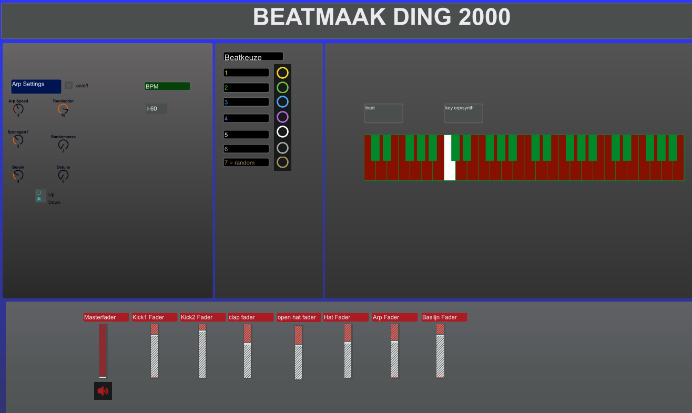

# Gui Prototype - Arping (Live)
  

This is a screenshot of an arp(tool) made with MAX MSP. This tool gives you the opportunity to alter multiple variables generally used in arps. This tool can be used in a (live)performance, because the arp is played under a customizable beat.

## Current interaction experience
As the designer on the patch, I am biased. Meaning, I know how the patch works and what everything does. However, the user flow is not that fluent. When starting up the patch, there is no clear starting point. In fact, the soundflow is initiated when clicking the speaker icon down under. After that, you are able to play the (saw) synth. You will notice that still nothing is going on, because you have to toggle the On/Off button besides the Arp Settings textbox. Furthermore, the beat will only start whenever your click on one of the colored buttons. Each number has it’s own rhythm. However, after initializing, the fun can start. You can modify your arp in all kinds of ways and also choose other rhythms for your beat. It would be very helpfull to see the rhythm of your beat for visual feedback. Besides the mentioned variables, it is also possible to add a corresponding bassline and detune your saw synth. It would be nice to modify these oscillators more, like changing the waveform and adding filters. In short, this live arp tool is very fun to play with, but it does take some time to get it up and running. In addition, very little feedback (when changing parameters).

________________
## Which GUI elements work?
* The individual elements are separated roughly by lines.
This makes it possible to distinguish to which element the parameters between the lines apply.

* A nametag in every concerning block.
This helps implicate to which element a variable applies.

* Arp variables names.
The descriptive names help you to understand what each parameter does.

* Visibility of the arp variables values.
This gives you instant feedback when adjusting the values. It might also help you to understand and make sense how the arpsound is affected by (change in) this parameter.

* The keyboard.
The keyboard makes it easy to see on which note/key the arpeggio is applied. The regarding key is lit up when played.

* The volume sliders.
This helps you to mix the full beat to your own liking. There are volume sliders for every single sound.

## Which GUI elements do not work?
* There is no clear alignment in the GUI;
* There is no logical user flow, where do you start when opening the tool/plugin?;
* The On/Off volume button is all the way down;
* The On/Off button of the arp is not that visible;
* The elements are not placed logically. For example, the keyboard first of all not a loose variable and secondly the placement makes no sense.
* The separation of the elements is not logically. For example, BPM does not only apply to the speed of the arp;
* There is no possibility to safe or load presets
* There is little to no visual feedback of what is happening after adjusting the parameter values;
* The volume sliders don’t really look like volume sliders;
* The colouring (of labels) is not cohesive;
* There is no consistency in the layout of the variables.

________________

## What would I change in design and implementation? In order of importance:
* Improve the workflow of the initialization. 
The elements must be arranged better and more logically
* Change the lay out
A uniform style, with the same knob and slider types.
* Adding a knob for filtering the sounds
* Make the drum patterns for the beat visible
This will contain of three visible sequences for the three beatlayers: Kick, Clap and Hihat.
* Replacing the volume sliders for sliders with dB information
* Adding waveforms icons in a logical place to adjust the soundwave
* Replacing the keyboard at the bottom
* Add a pop-up when adjusting the knobs, to clearly see the adjustment

## Making the use more fun
A way to facilitate a better user flow is to give a lot of visible feedback. This helps to user to understand what he/she is doing. Here we can think of adding arrows to the blocks to make the flow visible.

# MockUp
In this mockup, the allignment is way better. Also, only the associated parts are arranged in the specific space. This helps to understand how every element cooperates and alters the sound. In this mockup the visual feedback is more present

# Prototype

## Program Language
I have chosen JUCE (C++) to make the prototype. The reason I chose this, has to do with the fact that JUCE is specificly designed for making Audio Plugins. In fact, when starting up JUCE, you can even choose "GUI application" as projecttype. Hence JUCE seems very suitable

## Process
Working in a framework is a challenge I can say. It took some time for me to understand where I had to place code in order to work accordingly. I had to watch a lot of Juce Tutorials and had to browse in the API section a lot. By doing this and trying things my self, I was able to draw a grid. This Grid was meant as a demarcation for the distinctive elements. After this, I added layouts for every variable I was going to put in the Prototype. Here, I had to decide what layout would work best. As an example, in the Max project I used a dialknob to select a new tonal Scale. In this example, a Drop down menu was more suitable. After making all the variables, I put them each in their own new componentfiles. I did my best to get a long way, but unfortunately, I was not able to realise every aspect from the Visual Mock Up in the given amount of time. I really wanted to add a Midikeyboard at the bottom of the GUI. Furthermore, I wanted to a working beatgrid. I want to include these things in my next iteration, given more time.
However, I am happy with the way I structurized the layout and how I chose the variable layouts. For me this, increased the workflow, which was essential.
